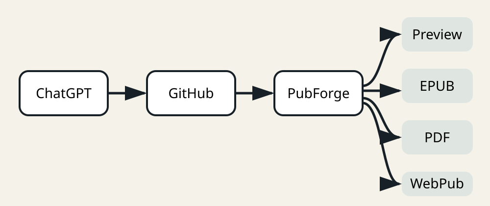
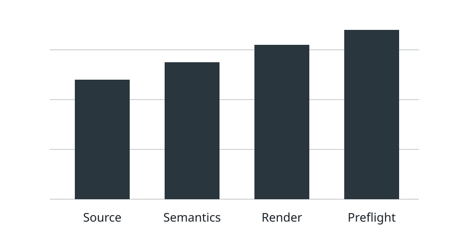

# Figures, Tables and Data

A rich publication should keep explanatory visuals close to the argument.

<figure id="pipeline-figure">
  
  <figcaption>Figure 1. One committed source feeds all publication outputs.</figcaption>
</figure>

## Table

The same underlying publication has different delivery characteristics:

| Output | Layout | Navigation | Typical use |
|---|---|---|---|
| PDF | Fixed pages | Page-based | print, archive, review |
| EPUB 3 | Reflowable | semantic spine and nav | e-readers |
| Web Publication | Responsive documents | publication manifest | browser distribution |

## Data as a project resource

The chart below is an SVG asset generated from a tiny CSV fixture. The source data remains part of the publication project.

The raw fixture is also available as [CSV](../data/quality-scores.csv) and [JSON](../data/quality-scores.json). Keeping source data next to the manuscript makes later regeneration auditable.

## A callout

<strong>Portable source.</strong> The SVG is useful in PDF, EPUB and the web without a raster-only dependency.

